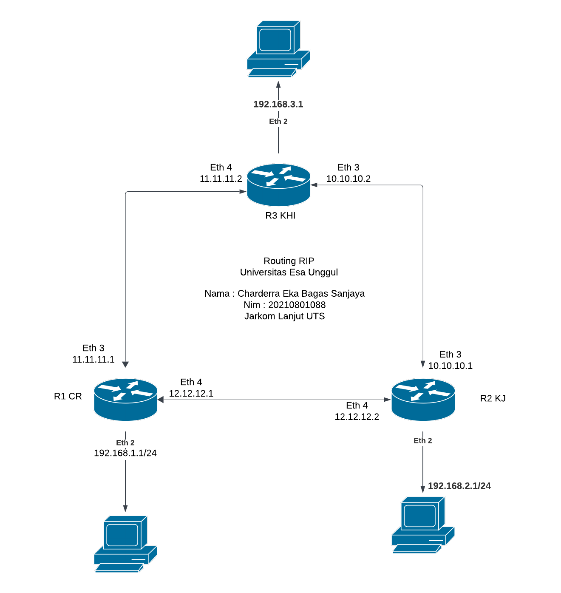

# UTS Jarkom Lanjut

Nama : Charderra Eka Bagas Sanjaya
Nim : 20210801088
Jarkom Lanjut UTS

## Essay

## Config

## Tech Stack

**Alat:** Mikrotik

## Analisis

Berikut adalah analisis komunikasi antar jaringan berdasarkan topologi:

1. **R1 CR ke R2 KJ:**

   - Komunikasi dari Citra Raya ke Kebon Jeruk melibatkan penggunaan IPIP tunnel dengan IP source 12.12.12.1 dan destination 12.12.12.2. Router di CR (R1 CR) mengirimkan paket melalui eth2, yang dikonfigurasi dengan IP 192.168.1.1, ke KJ.
   - KJ menerima paket ini melalui tunnel dan router KJ (R2 KJ) yang memiliki eth2 dengan IP 192.168.2.1, dapat mengarahkan paket ke KHI jika diperlukan.

2. **R2 KJ ke R1 CR:**

   - Dalam arah sebaliknya, jika KJ ingin mengirimkan data kembali ke CR, router KJ akan menggunakan koneksi tunnel yang sama dengan IP destinasi 12.12.12.1.
   - CR akan menerima ini melalui eth2 yang dikonfigurasi pada R1 CR.

3. **R2 KJ ke R3 KHI:**

   - Komunikasi dari Kebon Jeruk ke Harapan Indah menggunakan tunnel yang berbeda dengan IP source 11.11.11.2 dan destination 11.11.11.1. Router KJ mengirimkan paket dari eth2 (192.168.2.1) melalui tunnel yang terhubung ke R3 KHI.
   - KHI menerima paket ini di eth2 yang dikonfigurasi dengan IP 192.168.3.1, memungkinkan komunikasi antara KJ dan KHI.

4. **R3 KHI ke R2 KJ:**

   - Sebaliknya, KHI mengirim paket ke KJ menggunakan IP source 11.11.11.1 dan destination 11.11.11.2 melalui tunnel yang sama.
   - Paket ini diterima oleh KJ pada eth2 (192.168.2.1), memungkinkan pertukaran data dua arah antara KJ dan KHI.

5. **R1 CR ke R3 KHI dan R3 KHI ke R1 CR:**
   - Komunikasi lintas kampus dari CR ke KHI dan sebaliknya harus melalui KJ karena KJ bertindak sebagai router pusat yang menghubungkan kedua kampus lainnya.
   - Misalnya, CR mengirimkan paket ke KHI dengan cara mengirimkannya terlebih dahulu ke KJ melalui tunnel yang tersedia, kemudian KJ meneruskannya ke KHI melalui tunnel lain. Proses sebaliknya berlaku untuk komunikasi dari KHI ke CR.

**Kesimpulan:**
Kampus KJ memainkan peran kunci dalam topologi ini sebagai pusat penghubung antara CR dan KHI, dengan dua IPIP tunnel terpisah yang mengelola lalu lintas data antar kampus. Setup ini memungkinkan efisiensi dan pemisahan lalu lintas yang efektif antara lokasi yang berbeda, dengan menggunakan routing statis untuk memastikan bahwa data selalu mencapai tujuan yang tepat melalui jalur yang ditentukan.

## Authors

- [@bagas-sanjaya-UeU](https://github.com/bagas-sanjaya-UeU)

# Topologi

